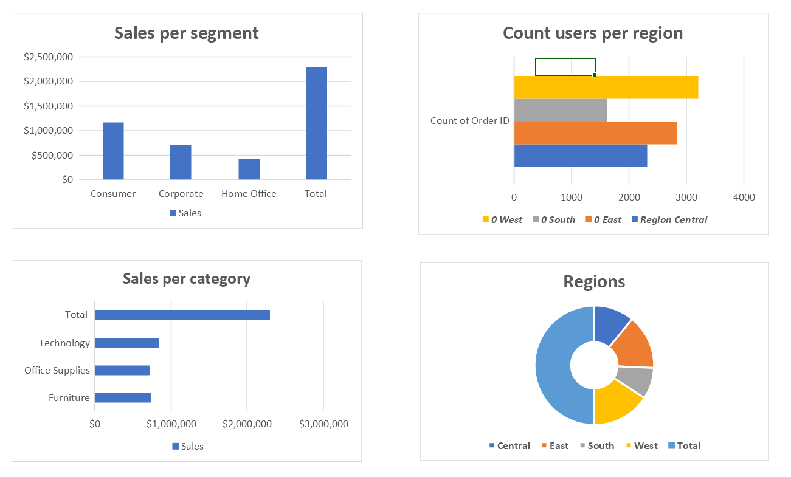
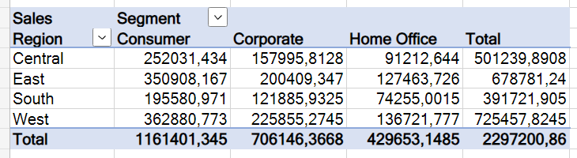
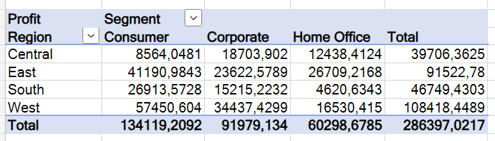

# Задание для Модуля 1

### Архитектура Аналитического Решения

Верхнеуровневая архитектура аналитического решения.

В данном модуле было необходимо создать архитектуру аналитического решения.
Архитектура аналитического решения представляет собой схему, на основе который строется работа с данными.
Построенная мной архитектура включает в себя три слоя:
1. Source Layer - слой источников данных
2. Storage Layer - слой хранения данных
3. Business Layer - слой доступа к данным бизнес пользователей

### Аналитика в Excel

При выполнении домашнего задания использовала web excel, который предлагает для пользования ограниченный пакет функций данного сервиса. Данного функционала для создания базового дашборда.

Был проведен анализ по ключевым метрикам:
1. Sales per segment
2. Sales per category
3. Sales per region
4. Total sales and profit
5. Profit per region
6. Count users per region

 

