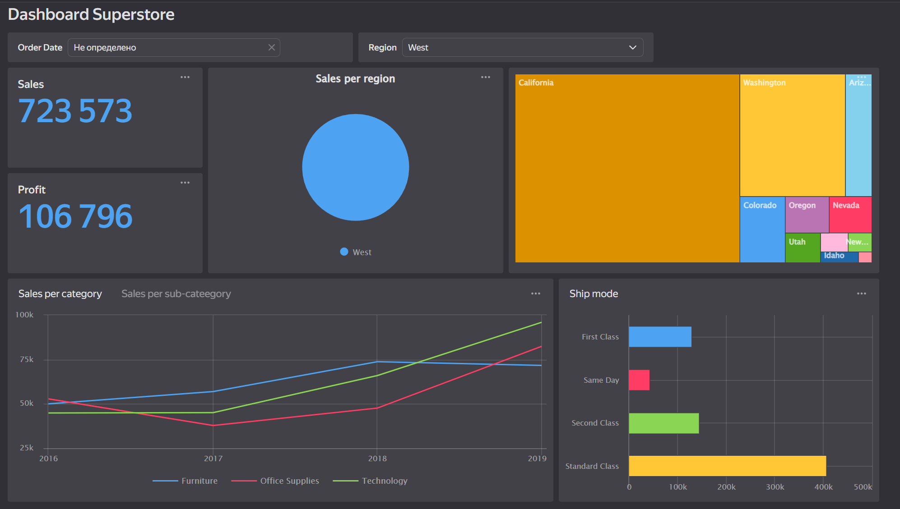

# Задание для модуля 2

 Данный модуль знакомит с базами данных. В ходе изучения были затронуты следующие важные темы:
 1. Понятие баз данных
 2. Инструменты для работы с базами данных (На примере PostreSQL)
 3. SQL
 4. Работа с базами данных в облаке
 5. Визуализация данных с помощью BI-инструментов
   

В ходе работы необходимо было установить клиент SQL для подключения безы данных (DBeaver), загрузить данные из Superstore Excel file в базу данных, написать запросы на SQL из модуля 1. 

Я использовала следующие ресурся для изучения языка:
1. [Симулятор SQL](https://lab.karpov.courses/)
2. [Интерактивный тренажер по SQL](https://stepik.org/course/63054?search=3088563851)
3. [Вопросы для собеседования по SLQ в 2023 году (базовые понятия)](https://vc.ru/u/1389654-machine-learning/580137-voprosy-dlya-sobesedovaniya-po-sql-v-2023-godu) 

## Загрузка  данных в БД
Необходимо было загрузить данные в базу данных.  

## SQL запросы
По заданию было необходимо написать SQL-запросы на основе запросов из модуля 1. 

## Нарисовать модель данных в SQLdbm
Далее необходимо было нарисовать модель данных для нашего файла. Модель данных представляет собой способ организации логической структуры хранения данных в базе. Также были даны ссылки на статьи Хабра.

## Нарисовать графики в Google Sheets
Визуализация - это процесс использования визуальных элементов, таких как диаграммы, графики или карты, для представления данных. 
Для визуализации я использовала Yandex Datalens. Сделала подключение к данным, которые находились в superbase. 
В Яндекс Практикум есть бесплатный курс по Yandex Datalens, который поможет новичкам даст общее представление работы в данном инструменте.

